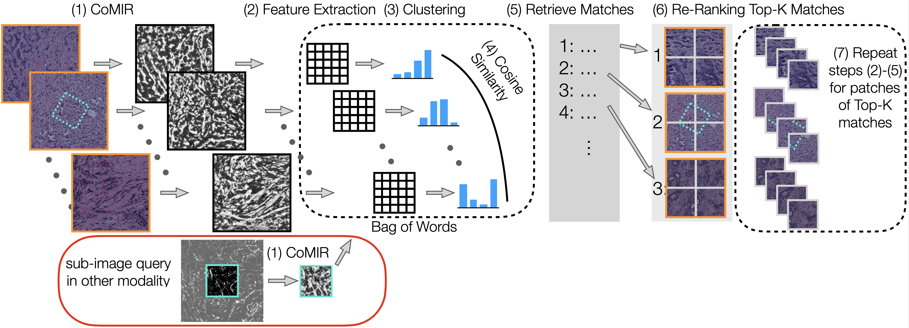

# Cross-Modality Sub-Image Retrieval using Contrastive Multimodal Image Representations

Code of our paper: [Cross-Modality Sub-Image Retrieval using Contrastive Multimodal Image Representations]

 [Pre-print version on arXiv](https://arxiv.org/abs/2201.03597)


## Table of Contents

- [Introduction](#introduction)
- [How does it work?](#how-does-it-work)
- [Key findings of the paper](#key-findings-of-the-paper)
- [Datasets](#datasets)
- [Creation of CBIR](#creation-of-cbir)
- [Scripts](#scripts)
- [Citation](#citation)


## Introduction
Multimodal imaging is a powerful tool used for many tissue characterizations as well as cancer diagnostics. The developments in the field of Digital Pathology make it possible that large datasets can be automatically acquired. To make these datasets searchable and allow for side-by-side examination of images in different modalities, content-based image retrieval (CBIR) systems are needed to index the datasets, and allow for retrieval and registration. We propose a CBIR pipeline which learns common representations for both input modalities and creates a bag of words for efficient retrieval of images in modality A, given its corresponding, rigidly transformed image or subimage in modality B. The method is general, does neither rely on data-specific information, nor image labels, and was evaluated on a challenging dataset of brightfield microscopy and second harmonic generation images.

<p align="center">
  
</p>

This repository provides the code needed to preform reverse image search between two sets of images. Any image in the first set can be used as a query to find its counterpart in the second set of images, and vice versa. The method requires no image labels. All code in this repository is written in Matlab 2021b. 
The code in this repository has been developed to allow for image retrieval across two different modalities. Contrastive Representation Learning is used to learn dense representations called CoMIRs, which map the original images into an abstract representation space. The (python) code needed to generate CoMIRs is given in [CoMIR Github Repo](https://github.com/MIDA-group/CoMIR/blob/90a4c919b853c090c602d2ca73ba87ddf6b01318/readme.md).

## How does it work?
The proposed CBIR method consists of three stages: (i) it first learns rotationally equivariant representations called CoMIRs using contrastive learning as introduced in Pielawski, Wetzer et al (2020) to bridge the semantic gap between the different modalities; (ii) it creates a bag-of-words (BoW) based on SURF features; (ii) and finally it uses re-ranking to refine the retrieval among the best-ranking matches. The pipeline is shown in the following figure.

<p align="center">
  
</p>

## Key findings of the paper
This repo provides code for the reverse image search across rigidly unaligned modalities, and evaluates it on BF and SHG microscopy images used in histopathology. Our study showed that CoMIRs are usable representations for cross-modality image retrieval. The requirement for rotationally equivariant representations was highlighted, as well as the rotational and translational invariance of the feature extractor applied to them to create the BoW. Re-ranking proved itself as a useful tool to boost the retrieval performance. 
The proposed combination of CoMIR representations and SURF features together with re-ranking reaches a 75.4\% top-10 success rate to retrieve BF query images in a set of SHG images, and 83.6\% to retrieve SHG query images within the set of BF images, combining the power of deep learning and robust, classical methods.

## Datasets
We used the following publicly available dataset:
* Multimodal Biomedical Dataset for Evaluating Registration Methods: https://zenodo.org/record/3874362

## Creation of CBIR
TODO

### Part 1: Generation of CoMIRs
In Pielawski, Wetzer et al. (NeurIPS 2020), a method was introduced which uses a contrastive loss to generate representations called CoMIRs. One CoMIR is created per input modality, using two identical U-Nets which are coupled by a contrastive loss. The CoMIRs of two corresponding images in BF and SHG are learnt such that they are similar with respect to a similarity measure, in this study mean squared error. Furthermore, CoMIRs are equivariant to rotation. Hyperparameters are chosen as in Pielwaski, Wetzer et al. The resulting 1-channel CoMIRs are saved in .tif format and used to create the CBIR. The (python) code needed to generate CoMIRs is given in [CoMIR Github Repo](https://github.com/MIDA-group/CoMIR/blob/90a4c919b853c090c602d2ca73ba87ddf6b01318/readme.md).

### Part 2: Feature Extraction


### Part 3: Creation of Bag of Words

### Part 4: Retrieval and Re-Ranking
Retrieval is performed by matching the histograms using cosine similarity. To further improve the retrieval results, the best ranked matches are re-ranked by taking a number of top retrieval matches and cut them into patches of the same size as the query (in case of full-image search, the entire image is used). The resulting patches form a database for which a new (s-)CBIR ranking is computed, using the same configuration as the initial one.

## Scripts
TODO

**Important:** for each script make sure you update the paths to load the correct
datasets and export the results in your favorite directory.

## Citation
```
@article{DBLP:journals/corr/abs-2201-03597,
  author    = {Eva Breznik and
               Elisabeth Wetzer and
               Joakim Lindblad and
               Natasa Sladoje},
  title     = {Cross-Modality Sub-Image Retrieval using Contrastive Multimodal Image
               Representations},
  journal   = {CoRR},
  volume    = {abs/2201.03597},
  year      = {2022},
  url       = {https://arxiv.org/abs/2201.03597},
  eprinttype = {arXiv},
  eprint    = {2201.03597},
  timestamp = {Thu, 20 Jan 2022 14:21:35 +0100},
  biburl    = {https://dblp.org/rec/journals/corr/abs-2201-03597.bib},
  bibsource = {dblp computer science bibliography, https://dblp.org}
}
```
